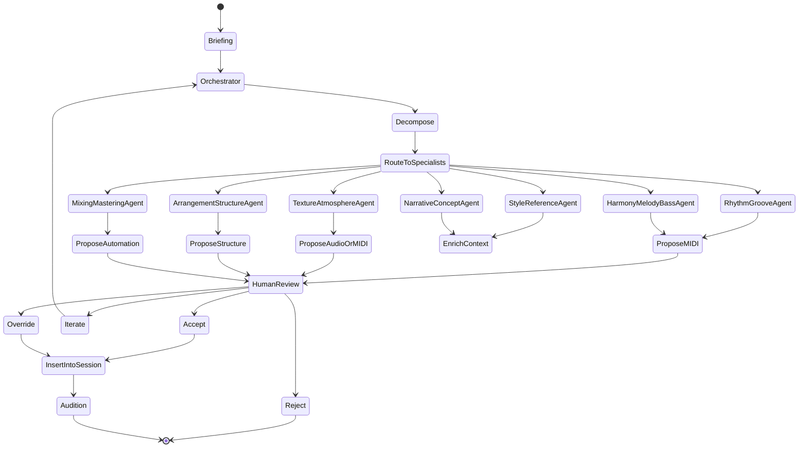

# Beehive Studio Architecture — High-Level Design

**Version**: 0.1 (Initial — post Phase 0 audit)  
**Status**: Proposed for review (following the Super Engineer Prompt)  
**Date**: 2026-05-30

---

## 1. Guiding Principles (Non-Negotiable)

1. **Agents as first-class creative collaborators** — not black boxes. Every action must be logged, explainable, and reversible. Human retains override authority at every step.
2. **Strict local-first** — default fully offline. External calls (NVIDIA NIM, etc.) are opt-in and clearly surfaced.
3. **Hybrid professional surface** — JetBrains-grade intelligence + Ableton Live-grade musical performance feel.
4. **One source of truth for creative state** — shared models between frontend and agent brain.
5. **Beehive Studio / Rhythmic Ritual DNA** — every agent and UI element must be able to reference the Beehive Studio graph for style, artist relationships, and ritual context.
6. **Honest limitations** — web audio fidelity, lack of VST hosting, and local model quality/speed must be documented and never hidden.

---

## 2. High-Level System Overview

```
┌─────────────────────────────────────────────────────────────────────┐
│                           Desktop (Tauri v2 + React 19)              │
│  ┌──────────────────────────────┐   ┌──────────────────────────────┐│
│  │   Composition / IDE Mode     │   │   Session / Performance Mode ││
│  │ (JetBrains-dominant)         │◄──┤   (Ableton-dominant)         ││
│  │ - Project / Ritual Explorer  │   │ - Session View (clip grid)   ││
│  │ - Intelligent Music Editor   │   │ - Arrangement View (timeline)││
│  │ - Agent Director             │   │ - Piano Roll + Mixer         ││
│  │ - Prompt Library + Versioning│   │ - Transport + Groove         ││
│  │ - Visual Agent Graphs (React Flow)│ - Real-time param modulation││
│  └──────────────────────────────┘   └──────────────────────────────┘│
│                              Unified Workspace Shell                 │
│                    (Global command palette + shortcut parity)        │
└─────────────────────────────────────────────────────────────────────┘
                                    │
                                    │ Tauri IPC (commands + events)
                                    ▼
┌─────────────────────────────────────────────────────────────────────┐
│                    Agent Orchestrator Service (FastAPI + LangGraph)  │
│  ┌──────────────────────────────────────────────────────────────┐  │
│  │                    Orchestrator / Director Agent             │  │
│  │  - Decomposes creative briefs                                │  │
│  │  - Maintains global Session state                            │  │
│  │  - Routes tasks + manages iteration loops                    │  │
│  └──────────────────────────────────────────────────────────────┘  │
│                                    │                                │
│         ┌──────────────────────────┼──────────────────────────┐     │
│         ▼                          ▼                          ▼     │
│  ┌──────────────┐          ┌──────────────┐          ┌──────────────┐│
│  │ Rhythm &     │          │ Harmony /    │          │ Texture /    ││
│  │ Groove Agent │          │ Melody / Bass│          │ Atmosphere   ││
│  └──────────────┘          └──────────────┘          └──────────────┘│
│         │                          │                          │       │
│         └──────────────────────────┼──────────────────────────┘       │
│                                    ▼                                  │
│  ┌──────────────────────────────────────────────────────────────┐    │
│  │                    Shared Structured State                   │    │
│  │   (LangGraph checkpointer + Pydantic models + optional graph)│    │
│  └──────────────────────────────────────────────────────────────┘    │
│                                    │                                  │
│         ┌──────────────────────────┼──────────────────────────┐       │
│         ▼                          ▼                          ▼       │
│  ┌──────────────┐          ┌──────────────┐          ┌──────────────┐ │
│  │ Arrangement  │          │ Mixing &     │          │ Style &      │ │
│  │ & Structure  │          │ Mastering    │          │ Reference    │ │
│  └──────────────┘          └──────────────┘          └──────────────┘ │
│                                    │                                  │
│                                    ▼                                  │
│  ┌──────────────────────────────────────────────────────────────┐    │
│  │                    Tool Layer                                │    │
│  │  - MIDI generation (mido / pretty_midi)                      │    │
│  │  - Beehive Studio Graph client (local NetworkX / lightweight store) │    │
│  │  - Reference track ingestion & analysis (librosa)            │    │
│  │  - Audio rendering / export pipelines                        │    │
│  └──────────────────────────────────────────────────────────────┘    │
└─────────────────────────────────────────────────────────────────────┘
                                    │
                                    │ (Future) MCP bridge
                                    ▼
┌─────────────────────────────────────────────────────────────────────┐
│                    Optional External Intelligence Layer            │
│  (Ollama primary • NVIDIA NIM opt-in • future Laboratory models)    │
└─────────────────────────────────────────────────────────────────────┘
```

**Data Flow (simplified happy path)**:
1. User gives high-level brief in Agent Director or directly in a Session.
2. Brief → Orchestrator (via IPC).
3. Orchestrator decomposes → routes to specialist agents with relevant Beehive Studio context.
4. Specialist agents use tools → produce MIDI clips, automation, structural suggestions.
5. Results streamed back → inserted into Session/Arrangement as first-class Clips.
6. User can audition immediately (Tone.js), accept/reject/iterate with full explanation trail.
7. All state checkpointed in LangGraph + persisted locally.

> **MVP Note (Sprint 1)**: Only the Orchestrator + Rhythm & Groove path is implemented. The full 8-agent diagram above shows the long-term vision. The first vertical slice focuses exclusively on one specialist agent producing audible MIDI in a basic Session View.

---

## 3. Core Modules & Responsibilities

### 3.1 Desktop Application (`apps/desktop`)

- **Shell & Modes**: Fluid switching between Composition Mode and Performance Mode. Both views operate on the same underlying `Session` model.
- **Session View**: Clip launcher grid. Clips can be MIDI, audio, or generative (agent-driven). Agents can launch, mutate, and trigger clips.
- **Arrangement View**: Multi-track timeline with regions, automation lanes, warping hooks.
- **Piano Roll**: AI-assisted variation, harmonization, counterpoint generation.
- **Agent Director**: High-level orchestration UI — critique, iteration control, visual graph of current agent activity (React Flow).
- **Intelligent Editor**: Supports Python, custom music DSL, raw MIDI data views, and visual node graphs. Context-aware assistance powered by the agent layer.
- **Beehive Studio Integration Surface**: Browser/picker for style references, artist relationships, prior co-production sessions.

**Key Technology Decisions**:
- Tauri v2 (chosen for native file access, performance, and local-first parity with JetBrains/Ableton feel).
- React 19 + TypeScript + shadcn/ui + Tailwind.
- React Flow for agent orchestration graphs.
- High-performance canvas (Konva or custom WebGL via Pixi.js or raw Canvas) for timeline and piano roll.
- Tone.js for immediate playback/sequencing (with clear documentation of fidelity limitations).

### 3.2 Agent Orchestrator Service (`services/agent-orchestrator`)

This is the brain. It must feel like a sophisticated creative collaborator, not a generator.

- **LangGraph** (preferred) or equivalent for stateful multi-agent workflows with persistent checkpointers.
- Every agent action produces a structured `AgentTask` record (reasoning trace, inputs, outputs, confidence, alternatives considered).
- Human-in-the-loop checkpoints are first-class (pause for approval, branch, rewind).
- Modular agent roles (see list in prompt). Each role is a LangGraph node or subgraph.

**State Management**:
- Primary: LangGraph checkpointer (Postgres or file-based for pure local).
- Secondary: Local SQLite for `Session` snapshots + `Beehive StudioReference` cache.
- Beehive Studio relational data: lightweight graph store (NetworkX in-process or a small embedded graph DB).

### 3.3 Shared Models (`packages/core-models`)

Single source of truth. Both TypeScript (frontend) and Python (agents) consume generated or hand-maintained parallel definitions.

See `DATA_MODELS.md` (to be created in same sprint).

### 3.4 Music Engine (`packages/music-engine`)

- Tone.js wrapper for real-time sequencing and auditioning in the browser.
- MIDI import/export using mido (Python) + conversion layer.
- Export pipelines: standard MIDI + audio stems, detailed project JSON/Markdown manifest, lightweight Ableton Live Set scaffolding (`.als` XML subset where feasible).

### 3.5 Beehive Studio Graph Layer (`packages/beehive-studio-graph`)

Local representation of the user's Beehive Studio knowledge graph (artists, rituals, co-production history, stylistic DNA, ÆNIMAL aesthetics).

Agents must be able to query this for coherence.

---

## 4. Agent State Machine (Simplified)



The real graph will be much richer (parallel execution, critique loops, reference ingestion, etc.).

---

## 5. Data Flow — Brief to Audible Clip (MVP Happy Path)

1. User enters brief in Agent Director: "Create a rolling 142 BPM acid techno bassline with swung 16ths, dark ritual atmosphere, referencing previous ÆNIMAL session #47".
2. Desktop → `POST /sessions/{id}/briefs` (or Tauri command).
3. Orchestrator receives brief + current `Session` snapshot + relevant Beehive Studio references.
4. Orchestrator spawns subgraph → StyleReferenceAgent pulls context → RhythmGrooveAgent + HarmonyMelodyBassAgent work in parallel.
5. Agents emit proposed `Clip` objects (MIDI data + metadata + reasoning trace).
6. Results returned to desktop → rendered as generative clips in Session View.
7. User hits play → Tone.js schedules the MIDI through chosen instrument/synth.
8. User can "Accept", "Ask for variations", "Critique", or manually edit in piano roll.

All steps are checkpointed. The user can rewind the entire agent conversation.

---

## 6. Technology Choices & Justifications

| Component                    | Choice                          | Rationale |
|-----------------------------|----------------------------------|---------|
| Frontend Shell              | Tauri v2 + React 19 + TS        | Matches prompt mandate. Native file access, performance, local-first. Already proven in Beehive codebase. |
| UI Primitives               | shadcn/ui + Tailwind            | Fast professional look, consistent with modern creative tools. |
| Agent Graphs                | React Flow                      | Best-in-class for visual orchestration UIs. |
| Timeline / Piano Roll       | Konva or custom WebGL/Canvas    | High performance needed for musical timing. Tone.js for audio side. |
| Real-time Playback          | Tone.js                         | Fastest path to audible results. Clear limitations documented. |
| Agent Orchestration         | LangGraph (Python)              | State-of-the-art for reliable multi-agent workflows with checkpoints. |
| Backend API                 | FastAPI + Pydantic v2           | Excellent DX, automatic validation, great async story. |
| Local LLMs                  | Ollama (primary)                | True local-first. Easy model swapping. |
| MIDI Handling               | mido + pretty_midi (Python)     | Mature, reliable symbolic music libraries. |
| Audio Analysis (references) | librosa                         | Standard for feature extraction. |
| Graph Layer                 | NetworkX (initial)              | Zero-dependency, fast for local use. Can swap later. |
| Persistence (desktop)       | SQLite + file-based             | Simple, reliable, local. |
| Persistence (agents)        | LangGraph checkpointer + SQLite | Durable agent memory. |

**Explicit Trade-offs**:
- Tone.js gives instant gratification but is not professional DAW audio quality. We will document this heavily and provide export paths to real DAWs.
- No VST hosting in Phase 1 (massive scope + licensing complexity). Instruments will be Tone.js instruments or simple sample playback initially.

---

## 7. Security & Privacy Posture

- Everything runs locally by default.
- No telemetry.
- When external models are enabled, the user must explicitly toggle them per session or globally, with clear warnings.
- Beehive Studio graph data never leaves the machine unless the user chooses to sync it.

---

## 8. Open Questions (to be resolved in early sprints)

- Exact MIDI representation inside `Clip` (raw bytes? pretty_midi objects? our own normalized schema?).
- How deeply the Piano Roll will support direct agent collaboration vs one-shot generation.
- Performance targets for real-time agent suggestions while a session is playing.
- How much of the "JetBrains-grade" editor experience can be achieved in the first 3–6 months (custom language server for the music DSL?).

---

**This architecture is deliberately ambitious but grounded in the Phase 0 audit of the existing Beehive strengths and the non-negotiable constraints in the original prompt.**

Next documents in this deliverable set:
- `DATA_MODELS.md` (TypeScript + Pydantic)
- `DIRECTORY_STRUCTURE.md`
- `SPRINT_1_PLAN.md`
- `LIMITATIONS.md`

All will be created in the same pass.