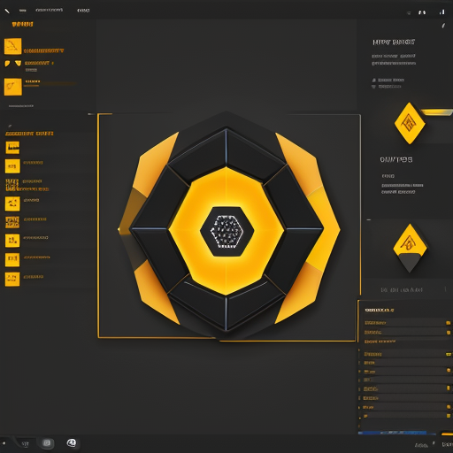
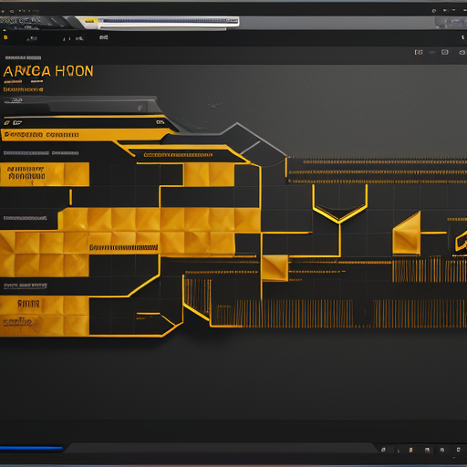
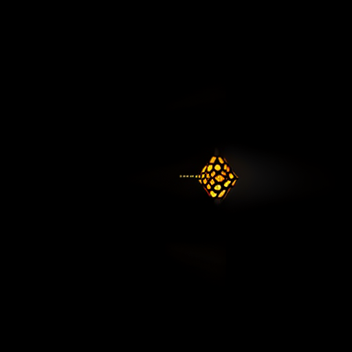

# Beehive Studio UI Style Guide — ComfyUI Concept Direction

Generated with the local ComfyUI installation using `DreamShaper_8_pruned.safetensors` and a bee/honey themed prompt.

## Concept Mockups

### Main Workbench Concept

### Timeline / Arranger Concept

### Mood Emblem

## Color Palette (extracted from main concept)

| Role | Hex | Usage |
|------|-----|-------|
| Deep background | `#1e1d1d` | Main canvas, empty areas |
| Panel background | `#252524` / `#2c2b2a` | Rail panels, cards, console |
| Primary accent | `#f3b217` | Play button, active states, honey highlights |
| Secondary accent | `#916c20` | Borders, inactive accents, scrollbar thumbs |
| Muted accent | `#4c412e` | Dividers, subtle panel borders |
| Text primary | `#e0e0e0` | Headings, labels |
| Text muted | `#a0a0a0` | Secondary labels, placeholder text |

## Visual Principles

- **Dark first**: near-black canvas keeps focus on clips and the timeline.
- **Honey accents**: use `#f3b217` sparingly for the playhead, selected clips, active agent, and transport controls.
- **Hexagon motif**: incorporate subtle hexagon shapes in logo, loading states, and button/icon highlights.
- **High contrast panels**: `#2c2b2a` panels float on `#1e1d1d` canvas with 1 px `#4c412e` borders.
- **Scrollbars**: themed with `#916c20` thumb / `#2c2b2a` track (already implemented).

## Component Targets

| Component | Current | Target from mockup |
|-----------|---------|--------------------|
| Top toolbar | flat gray row | grouped sections with honey active states |
| Left rail | icon-only tabs | icon rail with amber active indicator |
| Clip grid | colored rectangles | dark cards with honey hover/accent borders |
| Timeline | minimal line | bold amber playhead, hexagonal marker |
| Inspector | plain text fields | panel cards with subtle honey borders |
| Transport play | standard button | filled amber honey play button |

## Typography

- Use the existing system/UI sans-serif stack.
- Headings: 14–16 px, weight 600, `#e0e0e0`.
- Body/labels: 12–13 px, weight 400, `#e0e0e0`.
- Muted/meta: 11–12 px, `#a0a0a0`.

## Next Step

Apply this palette and component styling to the React/Tauri frontend. See `docs/superpowers/plans/` for the implementation plan.
